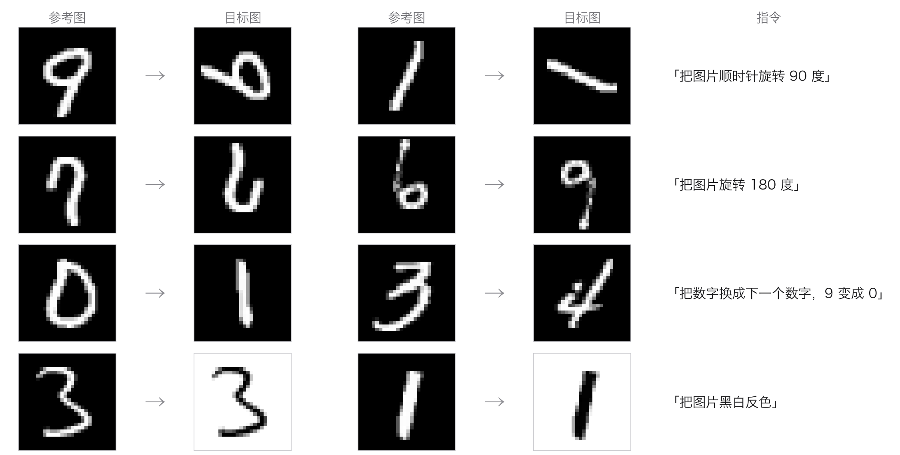
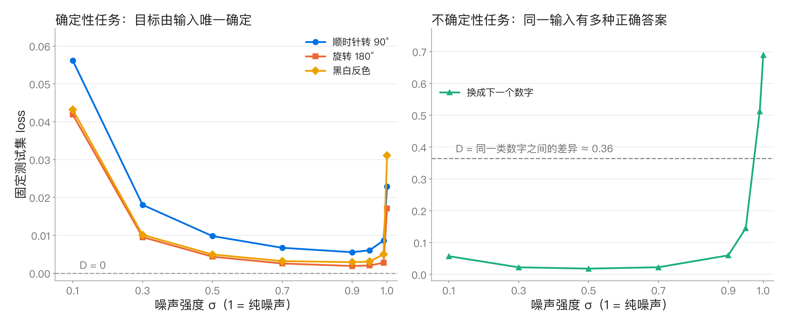
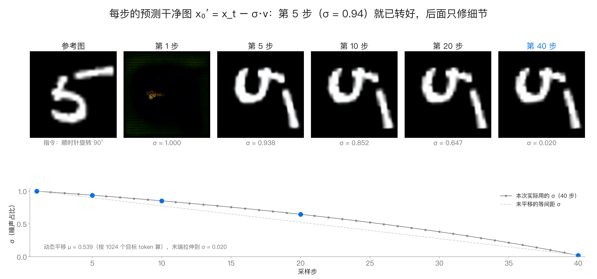

# qwen-image-edit-mnist

**Summary.** A small, fully reproducible practice project on the **Qwen-Image 2.1** image-editing model
(~16B parameters), built on four synthetic MNIST edits: rotate 90°, rotate 180°, "next digit" and invert. It walks
through one real model end to end: (A) a tensor-level trace of one edit forward pass, (B) LoRA fine-tuning with the
official diffusers img2img trainer (vendored, Apache-2.0, plus logging hooks), (C) inference sweeps over CFG /
shift / steps / LoRA scale, (D) loss vs noise level σ and the σ = 1 floor, and two training variants, (E) train-time
σ shift and (F) fixed "next" targets. A rank-32 LoRA trained for 3000 steps on 2000 pairs (1× H100, ~1.4 GPU-hours)
learns the deterministic edits (rotations 100 %, invert 94 %, IoU 0.94–0.99), and after fine-tuning they work in
2 sampling steps. "Next digit" stays at 6–31 %, and neither variant fixes it. Every script is tied to a page of the
Chinese lecture deck in `deck/`. **No weights are included**: the base model is under the qwen-research license and
the trained LoRA is not released.

---

## What this project teaches

It takes a task small enough to see completely and walks one real instruction-editing model through it end to end:
how the data is built, what one training step computes, how tensors flow through the model, what the training loss
says once it is split by task and by σ, how the success rate is scored, and what CFG / shift / steps / LoRA scale
each control at inference time. Three of the four tasks have a unique answer (the rotations and invert) and one does
not (the "next digit" target is another writer's n+1), and the contrast between what can and cannot be learned runs
through the whole project.

The companion lecture is [`deck/practice.html`](deck/practice.html) (19 slides in Chinese; download and open in
Chrome, `←` / `→` to navigate, see [`deck/README.md`](deck/README.md)). The table
"[Deck page → script → result file](#deck-page--script--result-file)" below maps every page to the scripts and data
in this repo; open the deck and follow it page by page alongside the code.

| Experiment | Content | Entry point |
| --- | --- | --- |
| A forward trace | Every step of one real edit forward pass: preprocessing, VAE, token packing, text encoding, joint sequence, block-causal mask, RoPE, modulation, KV cache, Euler update; the hand-written mirror loop matches the real `pipe(...)` pixel for pixel | `scripts/trace_forward.py` |
| B LoRA training | The official diffusers img2img LoRA trainer with read-only hooks only: per-step σ, held-out probe loss, periodic validation | `scripts/train_lora.sh` |
| C inference sweeps | Phase 1 base model, phase 2 LoRA scale, phase 3 CFG / shift / steps with the LoRA + per-step x0′ trace | `scripts/infer.py sweep` |
| D loss and σ | Loss vs σ per task, the σ = 1 floor D = E_c[Var(x0 \| c)], v loss = x0 error × 1/σ² | `scripts/probe_loss.py` |
| E train-time σ shift | Same as B, but each training σ is mapped to 5σ/(1+4σ), so a third of the steps land at σ > 0.9 | `train_lora.sh --train-shift 5` |
| F fixed next prototypes | Same as B, but the next target is one fixed prototype per digit (a unique answer) | `prepare_data.py --next-target proto` |



## The four tasks and their fixed instructions

| Task | Instruction (fixed, Chinese) | Target | Unique answer? |
| --- | --- | --- | --- |
| `rot90` | 把图片顺时针旋转 90 度 ("Rotate the image 90 degrees clockwise") | reference rotated 90° clockwise | yes |
| `rot180` | 把图片旋转 180 度 ("Rotate the image 180 degrees") | reference rotated 180° | yes |
| `next` | 把数字换成下一个数字，9 变成 0 ("Replace the digit with the next digit; 9 becomes 0") | **another writer's** n+1 (drawn by seed from the same split); a fixed prototype with `--next-target proto` | no (yes with proto) |
| `invert` | 把图片黑白反色 ("Invert black and white") | 255 − reference | yes |

The 28×28 grayscale digits are upsampled bicubically to 512×512 RGB. The training set `make_pairs('train', 500)` has
2000 pairs and the test set `make_pairs('test', 16)` has 64 (**16 per task**). For scoring, the output is resized
back to 28×28, the edit is undone (rotated back, inverted back), and a small self-trained CNN
(`src/qie_mnist/assets/mnist_cls.pt`, 1.6 MB, 98.8% MNIST test accuracy) classifies it; the edit succeeds when the
predicted digit equals the expected one. Deterministic tasks also report the pixel IoU against the ground truth.
**With only 16 images per task, one image is 6.25 percentage points**, so differences of a few points are noise.

## Layout

```text
src/qie_mnist/        data.py      tasks, fixed instructions, pair synthesis (random / proto next targets, task subsets)
                      evaluate.py  classifier, undo, success rate, IoU
                      probe.py     flow-matching loss at fixed σ / fixed noise (shared by the hooks and experiment D)
                      plotting.py  figure style (white background, one accent colour, CJK fonts)
                      assets/mnist_cls.pt  self-trained classifier (regenerate with scripts/train_classifier.py)
scripts/              prepare_data.py      step 1  data
                      train_lora.sh        step 2  training (B / E / F / task subset)
                      infer.py             step 3  single edit / inference sweeps (C phases 1-3)
                      summarize_results.py step 4  print the result JSON as the tables below
                      trace_forward.py     analysis A: tensor trace of one forward pass
                      probe_loss.py        analysis D: loss vs σ, σ-sweep visualisation
                      plot_*.py            step 5  deck figures (see the page table)
                      train_classifier.py  retrain the scoring classifier
train/                train_dreambooth_lora_qwenimage21_img2img.py  diffusers @ e0abab8 (Apache-2.0) + 4 hooks + --train_shift
                      train_hooks.py  hook implementation        hooks.patch  full diff against the upstream file
results/              train/             B's val / probe / train logs and σ summary
                      train_e_shift5/    E's val / probe logs and σ summary
                      train_f_proto/     F's val / probe logs
                      sweep/phase{1,2,3}/  C metrics per phase (phase3 also has x0trace.json)
                      probe/             D's results.json, vis_numbers.json
deck/                 the lecture (practice.html + figures in media/)
figures/              the two README figures that are not in the deck
```

## Hardware

| Step | Hardware | Peak memory | Time |
| --- | --- | --- | --- |
| Data, evaluation summary, most figures, classifier training | CPU | — | seconds to minutes |
| B training (3000 steps + 16 validations + probe every 50 steps) | 1× H100 80GB | 36 GiB | ~0.24–0.35 s/step; one validation (64 images × 40 steps) ~150 s; whole job 1.5–1.7 h |
| E / F training | E: 1× RTX PRO 6000 Blackwell 96 GB; F: 1× H100 80GB | 36 GiB | same order as B (F 1.6 h, E 2.3 h) |
| A forward trace | 1× H100 80GB | 33 GiB | ~30 s (excluding the weight download); 38 ms per sampling step with the KV cache, 73 ms without |
| C sweeps, phases 1 and 2 | 1× 96 GB card (RTX PRO 6000 Blackwell) | — | phase 1: 14 configs ~44 min; phase 2: 7 configs ~21 min |
| C sweep, phase 3 | 1× H100 80GB | — | 11 configs + x0′ trace ~28 min |
| D probe | 1× 96 GB card | — | ~13 min |

Every script that loads Qwen-Image 2.1 needs **one CUDA GPU with ≥ 40 GB** (bf16, all components on the GPU).

## Install

```bash
git clone https://github.com/ManagerZhang10/qwen-image-edit-mnist.git && cd qwen-image-edit-mnist
python -m venv .venv && source .venv/bin/activate      # Python 3.10+; the runs used 3.12
# Install torch for your CUDA first, e.g. CUDA 12.8:
pip install torch==2.11.0 torchvision==0.26.0 --index-url https://download.pytorch.org/whl/cu128
pip install -r requirements.txt
pip install -e .
```

To only look at the data and draw figures on a CPU,
`pip install torch torchvision numpy pillow matplotlib pyarrow && pip install -e . --no-deps` is enough.

**diffusers must be commit `e0abab83b5df05de9e7abd788643c1a7c1e42e28`**: `QwenImage21Pipeline`,
`AutoencoderKLQwenImage21` and the trainer under `train/` depend on it, and `requirements.txt` pins that commit's
source archive.

## Download the base-model weights (~31 GiB)

The weights are [`Qwen/Qwen-Image-2.1`](https://huggingface.co/Qwen/Qwen-Image-2.1) on Hugging Face, pinned here to
revision **`790c92633540aa0cb11d9abf19eb46d861714758`** (diffusers-format snapshot).

> **License: the Qwen-Image 2.1 weights are under the qwen-research license, not Apache-2.0.**
> Read and accept that license on the model page yourself before downloading; the permitted use is whatever its
> terms say. **This repository does not contain or redistribute any weights**, and its Apache-2.0 license covers
> only the code here. The **LoRA trained in these experiments is not released either**; train your own with the
> commands below.

```bash
hf download Qwen/Qwen-Image-2.1 \
  --revision 790c92633540aa0cb11d9abf19eb46d861714758 \
  --local-dir models/Qwen-Image-2.1
# Equivalent with the older CLI:
# huggingface-cli download Qwen/Qwen-Image-2.1 --revision 790c92633540aa0cb11d9abf19eb46d861714758 --local-dir models/Qwen-Image-2.1
```

- Size: ~31 GiB (33 GB). `transformer/` 13.25 GiB, `text_encoder/` (Qwen3-VL) 16.33 GiB, `vae/` 1.26 GiB.
- **The tokenizer and image processor live in `processor/`** (not the usual `tokenizer/`); the pipeline finds them.
- At the time of writing this revision downloads without logging in; if the model page later requires accepting the
  license, run `hf auth login` first.
- `MODEL=models/Qwen-Image-2.1` below refers to this directory; the deck p.3 thumbnails only need its `vae/`.

## Quickstart: one command per step

Run everything from the repository root. **Steps marked GPU need the weights above and a ≥ 40 GB card**; the rest
run on a CPU.

```bash
MODEL=models/Qwen-Image-2.1
```

**0. CPU self-check** (no GPU, no weights, tens of seconds)

```bash
python scripts/prepare_data.py --out outputs/smoke_data --n-per-task 4
python scripts/summarize_results.py        # print every results table below from the shipped results/
```

**1. Prepare data** (CPU; MNIST is downloaded to `./data`)

```bash
python scripts/prepare_data.py --out data/mnist_edit_train                       # B / E: 4 × 500 = 2000 pairs
python scripts/prepare_data.py --out data/mnist_edit_proto --next-target proto   # F: fixed prototypes as next targets
python scripts/prepare_data.py --out data/mnist_edit_next --tasks next           # a task subset (comma-separated, e.g. rot90,invert)
```

With `--next-target proto` every reference image, and the targets of the other three tasks, are identical to the
default data; only the next targets change.

**2. Train the LoRA** (GPU, ~1.5 h on an H100)

```bash
bash scripts/train_lora.sh $MODEL data/mnist_edit_train outputs/lora_smoke --smoke        # 6-step smoke test, run this first
bash scripts/train_lora.sh $MODEL data/mnist_edit_train outputs/lora_b                    # B: baseline
bash scripts/train_lora.sh $MODEL data/mnist_edit_train outputs/lora_e --train-shift 5    # E: train-time σ shift 5
bash scripts/train_lora.sh $MODEL data/mnist_edit_proto outputs/lora_f                    # F: reads summary.json, so the test set also uses prototypes
bash scripts/train_lora.sh $MODEL data/mnist_edit_next  outputs/lora_next                 # next only (the test set keeps all four tasks)
# outputs: outputs/lora_b/ckpt-3000/pytorch_lora_weights.safetensors, outputs/lora_b/hook_logs/{train,probe,val}.jsonl
```

More options: `--steps`, `--val-every`, `--probe-every`, `--n-val`, `--resume latest`; see
`bash scripts/train_lora.sh --help`.

**3. Inference / inference-setting sweeps** (GPU)

```bash
python scripts/infer.py edit --model $MODEL --task rot90 --index 0 --out outputs/edit_base
python scripts/infer.py edit --model $MODEL --task invert --lora outputs/lora_b/ckpt-3000 --steps 4 --out outputs/edit_lora
python scripts/infer.py sweep --model $MODEL --phase 1 --out outputs/sweep/phase1                                 # base-model knobs
python scripts/infer.py sweep --model $MODEL --phase 2 --lora outputs/lora_b/ckpt-3000 --out outputs/sweep/phase2  # LoRA scale
python scripts/infer.py sweep --model $MODEL --phase 3 --lora outputs/lora_b/ckpt-3000 --out outputs/sweep/phase3  # CFG/shift/steps with the LoRA + x0′ trace
```

**4. Evaluation summary** (CPU)

```bash
python scripts/summarize_results.py b --train outputs/lora_b/hook_logs          # success over training, first step >= 90%
python scripts/summarize_results.py e f --e outputs/lora_e/hook_logs --f outputs/lora_f/hook_logs --train outputs/lora_b/hook_logs
python scripts/summarize_results.py c --sweep outputs/sweep                     # inference settings
```

**5. Analysis** (GPU)

```bash
python scripts/trace_forward.py --model $MODEL --out outputs/trace                                   # A
python scripts/probe_loss.py measure --model $MODEL --lora outputs/lora_b/ckpt-3000 --out outputs/probe   # D
python scripts/probe_loss.py vis --model $MODEL --lora outputs/lora_b/ckpt-3000 --out outputs/probe/vis
```

**6. Redraw the figures** (CPU; written to `outputs/figures/` by default, with the same file names as `deck/media/`
so you can compare directly)

```bash
python scripts/plot_tasks.py                                   # deck p.1, p.2
python scripts/plot_train.py                                   # deck p.8, 9, 13, 15 (from results/train/)
python scripts/plot_probe.py                                   # deck p.11 (from results/probe/)
python scripts/plot_sweep.py --phase 2 && python scripts/plot_sweep.py --phase 3   # curves and bars of deck p.16-19 (from results/sweep/)
python scripts/plot_trace.py mask_simple                       # deck p.6 (schematic, no data)
# These need image outputs from your own runs (the repo ships small JSON only, no images):
python scripts/plot_train.py --src outputs/lora_b/hook_logs    # adds deck p.14 (validation images)
python scripts/plot_probe.py --vis outputs/probe/vis           # adds deck p.10
python scripts/plot_scoring.py --src outputs/sweep/phase3      # deck p.12
python scripts/plot_sweep.py --phase 3 --src outputs/sweep     # full deck p.16, 17, 19 with thumbnails (phase 2 likewise)
python scripts/plot_trace.py --src outputs/trace prep flow     # deck p.5; flow is a matplotlib version of p.4
python scripts/plot_train_step.py --vae $MODEL/vae --vis outputs/probe/vis   # deck p.3 latent thumbnails (needs the VAE and diffusers)
```

Without GPU outputs, `plot_sweep.py` still draws the full layout and puts a one-line note where the thumbnails go;
the finished figures are in `deck/media/`.

## Deck page → script → result file

Page numbers follow `deck/practice.html` (cover = 1); the Chinese title is the one shown on the slide. "Repo data"
says whether `results/` alone is enough to redraw the figure; "needs outputs" means image outputs from your own run
(the repo ships no large files; the finished figures are in `deck/media/`).

| Page | Title (Chinese title on the slide) | Script that produces the data | Plot script → figure | Repo data |
| --- | --- | --- | --- | --- |
| 1 | Cover (封面) | `src/qie_mnist/data.py` | `plot_tasks.py` → `practice_strip.png` | no data needed (generated on CPU) |
| 2 | Four edit tasks (四种编辑任务) | `data.py`, `prepare_data.py` | `plot_tasks.py` → `qi21_tasks.png` | no data needed |
| 3 | One training step (训练一步怎么走) | `probe_loss.py vis` (x0′ thumbnail) + the VAE from the weights | `plot_train_step.py` → `tf_*.png` | needs the VAE and `outputs/probe/vis/rot90_11_x0hat_0.5.png` |
| 4 | Tensor flow (张量怎么走) | `trace_forward.py` | **static image (draw.io), no generator script**; `plot_trace.py flow` draws a matplotlib version from the same trace | needs outputs (trace) |
| 5 | Two preprocessing paths for the reference image (参考图的两条预处理) | `trace_forward.py` | `plot_trace.py prep` → `qi21_a_prep.png` | needs outputs (trace) |
| 6 | Block-causal attention (块因果注意力) | `trace_forward.py` (numbers of the perturbation check) | `plot_trace.py mask_simple` → `qi21_a_mask_simple.png` | no data needed (schematic) |
| 7 | Where the LoRA goes (LoRA 挂在哪) | `train_lora.sh` (`--lora_layers`, rank 32) | **static image (private drawing tool + draw.io), no generator script** | — |
| 8 | Training loss (训练 loss) | `train_lora.sh` → `hook_logs/train.jsonl`, `probe.jsonl` | `plot_train.py` → `qi21_b_loss.png` | `results/train/` ✓ |
| 9 | Loss by sigma (按 σ 看 loss) | `train_lora.sh` → `probe.jsonl` | `plot_train.py` → `qi21_b_probe_by_task.png` | `results/train/` ✓ |
| 10 | Sigma sweep of the x0 guess (σ 扫描看 x0 猜测) | `probe_loss.py vis` | `plot_probe.py --vis` → `qi21_b_sigma_vis.png` | numbers in `results/probe/vis_numbers.json`; thumbnails need outputs |
| 11 | loss = x0 error × 1/σ² (loss = x0 误差 × 1/σ²) | `probe_loss.py measure` | `plot_probe.py` → `qi21_b_sigma_decomp.png` | `results/probe/results.json` ✓ |
| 12 | How success is scored (成功率怎么算) | `infer.py sweep --phase 3` (lora1.0 outputs), `evaluate.py` | `plot_scoring.py` → `qi21_c_scoring.png` | needs outputs (5 generated images) |
| 13 | Success rate (成功率) | `train_lora.sh` → `val.jsonl` | `plot_train.py` → `qi21_b_success.png` | `results/train/` ✓ |
| 14 | Before vs after training (训练前后对照) | `train_lora.sh` → `hook_logs/val/step_*/` | `plot_train.py --src <hook_logs>` → `qi21_b_samples.png` | needs outputs (validation images) |
| 15 | Learnable vs not learnable (学得会 vs 学不会) | `train_lora.sh` → `val.jsonl`, `probe.jsonl` | `plot_train.py` → `qi21_b_task_order.png` | `results/train/` ✓ |
| 16 | CFG (CFG) | `infer.py sweep --phase 3` | `plot_sweep.py --phase 3` → `qi21_c_lora_cfg.png` | numbers in `results/sweep/phase3/` ✓; thumbnails need outputs |
| 17 | Shift (shift) | `infer.py sweep --phase 3` | `plot_sweep.py --phase 3` → `qi21_c_lora_shift.png` | same as above |
| 18 | LoRA scale (LoRA 强度) | `infer.py sweep --phase 2` | `plot_sweep.py --phase 2` → `qi21_c_lora_scale.png` | numbers in `results/sweep/phase2/` ✓; thumbnails need outputs |
| 19 | Sampling steps (采样步数) | `infer.py sweep --phase 3` | `plot_sweep.py --phase 3` → `qi21_c_lora_steps.png` (plus `qi21_c_lora_x0hat.png`) | numbers in `results/sweep/phase3/` ✓; thumbnails need outputs |

## Results

`python scripts/summarize_results.py` prints the full numbers from `results/`. **16 test images per task, one image
= 6.25 percentage points**; differences of a few points below may be one or two images.

### B before and after training (40 sampling steps, CFG 1)

| | rotate 90° clockwise | rotate 180° | next digit | invert | mean |
| --- | --- | --- | --- | --- | --- |
| base model (step 0) | 75% (IoU 0.37) | 62% (0.44) | 25% | 38% (0.01) | 50.0% |
| step 200 | 81% (0.40) | **100% (0.97)** | 6% | 19% (0.00) | 51.6% |
| LoRA step 3000 | **100% (0.94)** | **100% (0.97)** | 12% | **94% (0.99)** | 76.6% |
| first step ≥ 90% | 400 | 200 | not within 3000 steps | 600 | |

- **What is learned**: the two rotations and invert are deterministic per-pixel transforms, learned in a few hundred
  steps, IoU 0.94–0.99. The base model does rotate but redraws the digit (IoU 0.37), and it never inverts (IoU 0.01;
  its 38% is the classifier happening to be right on the un-inverted image).
- **What is not learned**: the "next digit" target is another writer's n+1, so one input has no unique answer; the
  success rate stays at 0–19% for all 3000 steps.
- **Loss and success rate disagree**: the held-out loss has done about 80% of its total drop by step 200
  (0.043 → 0.025 → finally 0.020), while the success rate jumps in steps between 200 and 600; at step 200 invert even
  drops from 38% to 19% first.

### C inference settings (step-3000 LoRA, the same 64 inputs and noise)

| Knob (phase 3, LoRA scale 1.0) | Mean success | Next digit | Other three tasks | Time per image |
| --- | --- | --- | --- | --- |
| CFG 1 (default) / 2 / 4 / 7 | 75.0% / 78.1% / 81.2% / 81.2% | 6% / 19% / 31% / 31% | unchanged (100 / 100 / 94%) | 2.3 s → 4.6 s (CFG > 1 runs two forward passes per step) |
| fixed shift 1 / default dynamic (≈1.71) / 3 / 6, 40 steps | 75.0% / 75.0% / 76.6% / 76.6% | 6% / 6% / 12% / 12% | unchanged | same |
| 2 / 4 / 8 / 16 / 40 sampling steps | 76.6% / 75.0% / 75.0% / 78.1% / 75.0% | 12% / 6% / 6% / 19% / 6% | 100 / 100 / 94% from 2 steps on | 0.29 s (2 steps) vs 2.33 s (40 steps), 8× faster |

| Knob (phase 2) | Mean success | Next digit | Notes |
| --- | --- | --- | --- |
| LoRA scale 0 / 0.5 / 1.0 / 1.5 | 46.9% / **81.2%** / 76.6% / 73.4% | 25% / 31% / 12% / 0% | scale 0 matches the base model pixel for pixel; 0.5 already learns the rotations and invert and removes the colour artefacts; > 1 keeps pushing "next digit" down |

- **Takeaways**: after fine-tuning, the edits with a unique answer **need only 2 steps**; CFG only helps "next digit"
  (at twice the time); at 40 steps shift barely matters (few steps × different shifts was not tested); LoRA scale 0.5
  is enough. With few steps "next digit" comes out as a blurry "mean image" and only becomes a concrete digit from
  16 steps on.
- Phase 3 ran on an H100 and phases 1 and 2 on an RTX PRO 6000: the same config (LoRA 1.0, 40 steps) scores 75.0% in
  phase 3 and 76.6% in phase 2, one "next digit" image apart; times are not comparable across phases either.
- Phase 1 (base model) findings: CFG 4 / 7 make the rotations follow the instruction better (mean 46.9% →
  57.8% / 60.9%); 2-step outputs are dark and blurry; the KV cache is 1.91× faster with all 64 verdicts identical;
  turning causal_condition off gives cleaner images (**an observation on this toy task only, not checked against the
  official inference code**).

### D loss and σ (LoRA step 3000, mean over 16 images × 4 noise draws)

| σ | 0.1 | 0.5 | 0.9 | 0.99 | 1.0 |
| --- | --- | --- | --- | --- | --- |
| 90° / 180° / invert | 0.056 / 0.042 / 0.043 | 0.010 / 0.004 / 0.005 | 0.006 / 0.002 / 0.003 | 0.009 / 0.003 / 0.005 | 0.023 / 0.017 / 0.031 |
| next digit | 0.057 | 0.018 | 0.060 | 0.513 | 0.690 |

- At σ = 1, x_t carries no information about x0, so the best prediction is E[x0|c] and the loss is bounded below by
  **D = E_c[Var(x0|c)]**. D = 0 for the deterministic tasks; for "next digit" it measures **D ≈ 0.36** in the
  training latents.
- **The identity v loss = x0 error × 1/σ²**: the left end (small σ) is the 1/σ² amplification, present in every task;
  the right end (σ → 1) is the x0 error shooting up once the target is no longer visible, which only the
  non-unique "next digit" shows clearly, hence its U shape.
- For "next digit" the loss at σ = 0.9 is only 1/6 of D (image structure lets x_t still leak most of x0); at σ = 1 it
  is 0.69 ≈ 1.9 × D: the excess is a bias term, because the model has not learned the task.



### E / F: two training variants (everything else as in B)

| | B (baseline) | E (train-time σ shift 5) | F (fixed next prototypes) |
| --- | --- | --- | --- |
| σ actually used in training: mean / share σ > 0.9 | 0.50 / 10% | 0.75 / 34% | same as B |
| first step ≥ 90%: 90° / 180° / invert | 400 / 200 / 600 | **200 / 200 / 200** | 800 / 200 / 600 |
| mean success at step 200 | 51.6% | **76.6%** (invert 19% → 94%) | 51.6% |
| mean success at step 3000 | 76.6% | 76.6% | 78.1% |
| next success (mean / max over steps 200–3000) | 7.5% / 19% | 7.5% / 19% | 6.7% / 19% |
| next share copied from the source (same mean) | 0.16 | 0.08 | 0.10 |
| probe loss at step 3000, σ = 0.1 | reference | 11–18% higher for every task (small σ is trained less) | the three deterministic tasks match B |
| probe loss at step 3000, next at σ = 0.9 | 0.060 | 0.061 | 0.046 (the target changed, so the absolute value is not directly comparable) |

- **E**: putting a third of the training steps at σ > 0.9 makes the deterministic edits converge 2–3× faster in
  steps, but the final numbers match B and "next digit" is still not learned.
- **F**: with a fixed target the next loss does drop, but the success rate and IoU (against the prototype, 0.09–0.23
  throughout) stay in the same noise band as B; the 4 "1→2" test samples, which share one prototype target, are drawn
  as 9 / 0 / 9 / 3. F's 90° also dips between steps 400 and 600 (down to 31%) and recovers by step 800; the cause was
  not investigated.
- Together: "next digit" failing is explained neither by too little high-σ training nor by the target variance (D)
  alone.
- E's step-0 (base model) validation differs from B by one image (90° 69% vs 75%): B and F ran on H100 and their
  step-0 predictions agree exactly; E ran on an RTX PRO 6000 Blackwell, where 2 of the 64 predictions differ and one
  rot90 sample flips from success to failure. bf16 differences between GPU models flip borderline samples; runs on
  the same GPU model reproduce.

### A few facts from the forward trace (A)

Zero-shot rot90: at step 5 (σ = 0.94) the one-step prediction x0′ is already the rotated digit; the remaining 35
steps only refine details:



- A 512² image becomes 32×32×64 through the 16× VAE; one token = 16×16 pixels, with **no 2×2 packing**.
- The joint sequence has 2073 tokens: text 8 → reference 1024 → instruction etc. 17 → target 1024. Block-causal mask:
  lower-triangular within text segments, fully connected within each image, so **the reference tokens cannot see the
  instruction after them** (a perturbation test measures a difference of exactly 0.0).
- The 1049 prefix tokens use the t = 0 modulation row, independent of the step, so they can be computed once into the
  KV cache; each later step computes only the 1024 target tokens, about 1.9× faster sampling.
- The text features are Qwen3-VL's last layer **before the final norm** (std 11.2 vs 2.3). transformers 5.x returns
  the normed values by default, and the pipeline undoes that with a hook.

## Training hyperparameters (experiment B, `scripts/train_lora.sh` defaults)

| Item | Value |
| --- | --- |
| Data | 2000 pairs (4 tasks × 500), batch 1 (the instructions put the image pad at different positions and the trainer refuses mixed batches), 3000 steps = 1.5 epochs |
| LoRA | rank 32, alpha 32, layers `to_k,to_q,to_v,to_out.0,img_mlp.proj,img_mlp.gate_layer,img_mlp.out`, 448 tensors, 83.9 M parameters |
| Optimisation | AdamW, lr 1e-4 constant, no warmup, weight decay 1e-4, gradient clipping 1.0, seed 0 |
| Precision / resolution | bf16, 512×512, `--cache_latents`, no `--random_flip` (a flip would change the meaning of the rotation tasks) |
| σ sampling | `--weighting_scheme none`: σ ~ U(0,1) at train time, loss weight 1; with `--train-shift S` it is then mapped to Sσ/(1+(S−1)σ) (E used 5); the sampling-time shift is unrelated |
| Validation | `make_pairs('test', 16)`, 64 images, image i seeded 1000+i, 40 steps, CFG 1.0, every 200 steps |
| Probe | the same 64 images, σ ∈ {0.1, 0.3, 0.5, 0.7, 0.9}, fixed noise per image (seed 1234+i), every 50 steps |

## Limitations

- **Fixed instruction templates**: one Chinese sentence per task, no paraphrases. The 2000 training pairs use only 4
  sentences, so the model learns "these 4 sentences → these 4 transforms"; nothing here shows it understands other
  phrasings. Real editing data needs diverse human-written or LLM-paraphrased instructions.
- **Small samples**: 16 test images per task, one image = 6.25 points; the resolution comparison in C phase 1 used
  only 8 images.
- **Scoring relies on one MNIST classifier**: lenient with redrawing, sensitive to artefacts, optimistic for the base
  model; IoU says more about whether the pixels line up.
- **The "next digit" failure** is the result for this data size, LoRA rank and 3000 steps (E and F did not rescue
  it); more data, longer training or a higher rank were not tried.
- **Better results with causal_condition off** were not checked against the official inference implementation and
  should not be taken as a conclusion.
- **Environment differences**: A, B, E and F used torch 2.11 + CUDA 12.8 (A, B, F on H100, E on RTX PRO 6000
  Blackwell); C and D used torch 2.13 + CUDA 13.0, and C phases 1–2 and phase 3 ran on different GPUs. diffusers was
  always e0abab8 and transformers always 5.17.0. In bf16, numbers are not bit-identical across GPU models and
  borderline verdicts can flip; runs on the same GPU model reproduce.
- **Deck p.4 and p.7 are static images** (draw.io / a private drawing tool); the repo has no generator for them.
- **No weights are released**: download the Qwen base weights from Hugging Face as described above; the LoRA trained
  here is not public, so train your own.

## License

The code is under [Apache-2.0](LICENSE). `train/train_dreambooth_lora_qwenimage21_img2img.py` comes from Hugging Face
diffusers (Apache-2.0); its source commit and changes are listed in [NOTICE](NOTICE). The Qwen-Image 2.1 weights are
under the qwen-research license, outside this repository's license. MNIST is downloaded at run time through
torchvision.
