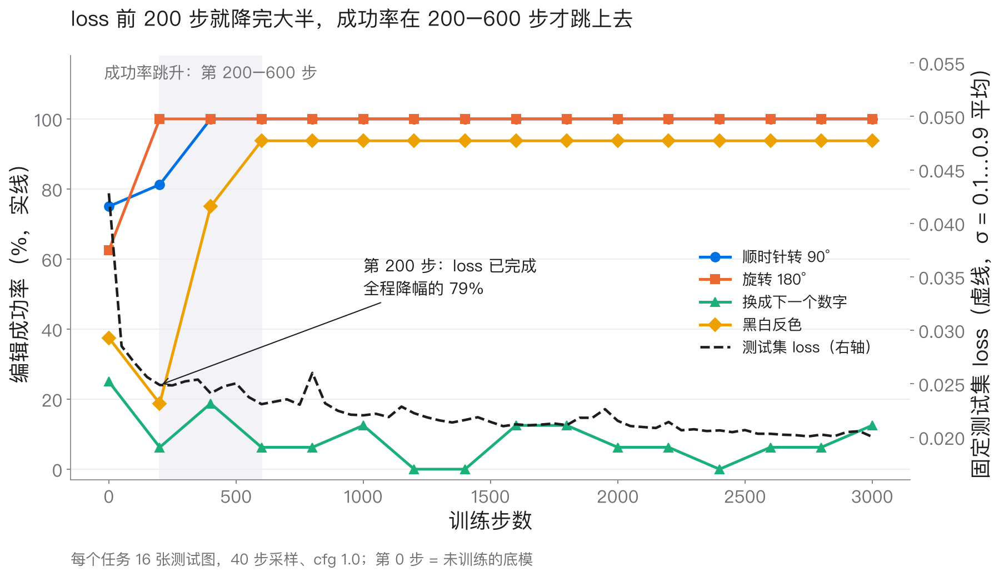
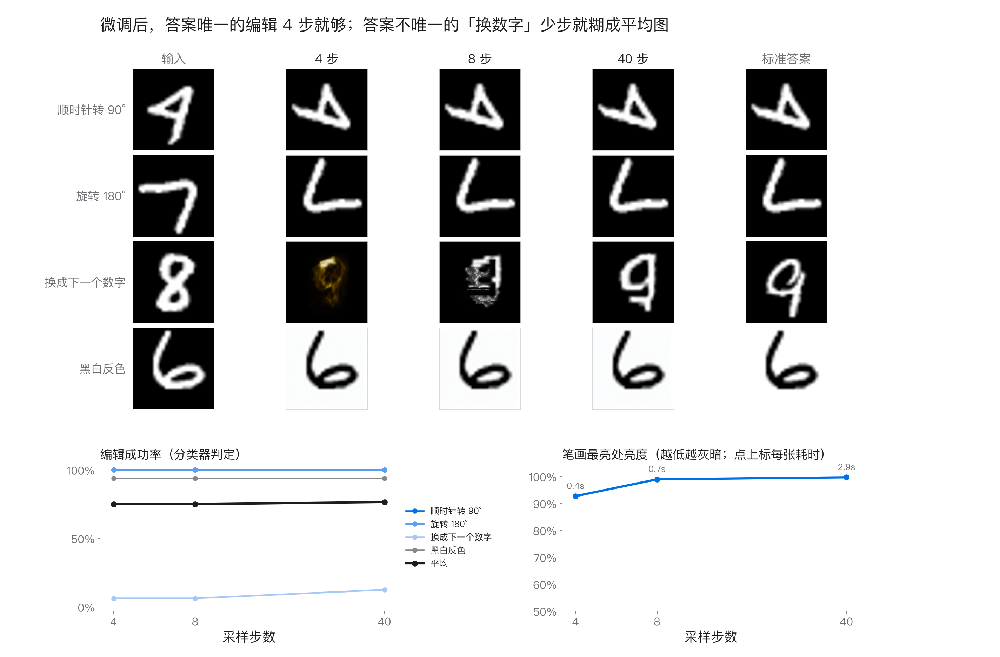

# qwen-image-edit-mnist

**English summary.** A small, fully reproducible practice experiment on the **Qwen-Image 2.1** image-editing
model, using four synthetic MNIST edits: rotate 90°, rotate 180°, "next digit" and invert. It contains:
(A) a tensor-level trace of one real edit forward pass, (B) LoRA fine-tuning with the official diffusers
img2img trainer (vendored, Apache-2.0, plus 4 logging hooks), (C) inference sweeps over steps / CFG / shift /
KV cache / causal_condition / resolution / LoRA scale, and (D) an analysis of the loss vs noise level σ and the
σ = 1 loss floor. Main findings: a rank-32 LoRA trained for 3000 steps on 2000 pairs learns the deterministic
edits (rotations 100 %, invert 94 %, IoU 0.94–0.99) and after fine-tuning they work in 4 sampling steps. "Next
digit" has no unique answer and stays at 12–31 %. Training ran on 1× H100 80GB in about 1.4 GPU-hours. **No
weights are included.** The base model is under the qwen-research license, and the trained LoRA is not
released. The documentation below is in Chinese.

---

## 这个项目展示什么

用一个小到能完全看清楚的任务，把一个真实的指令编辑模型（Qwen-Image 2.1，约 16B 参数）从头到尾走一遍：

| 部分 | 内容 | 入口 |
| --- | --- | --- |
| A 前向追踪 | 一次真实编辑前向的每一步：图像预处理、VAE、token 打包、文本编码、联合序列、块因果 mask、RoPE、调制、KV 缓存、Euler 更新；手写的镜像循环和真实 `pipe(...)` 逐像素一致 | `scripts/trace_forward.py` |
| B LoRA 训练 | diffusers 官方 img2img LoRA 脚本原样使用，只加 4 个只读挂钩：记录每步 σ、固定测试集 probe loss、定期验证 | `scripts/train_lora.sh` |
| C 推理扫描 | 步数、CFG、shift、KV 缓存、causal_condition、分辨率、LoRA scale 对成功率、画质、耗时的影响 | `scripts/infer.py sweep` |
| D loss 与 σ | 每个任务 loss 随 σ 的变化，以及 σ = 1 处的理论下界 D = E_c[Var(x0 \| c)] | `scripts/probe_loss.py` |


## 四个任务和固定指令

| 任务 | 指令（固定中文） | 目标 | 答案唯一？ |
| --- | --- | --- | --- |
| `rot90` | 把图片顺时针旋转 90 度 | 参考图顺时针转 90° | 是 |
| `rot180` | 把图片旋转 180 度 | 参考图转 180° | 是 |
| `next` | 把数字换成下一个数字，9 变成 0 | **另一个人写的** n+1（按种子从同一 split 里抽） | 否 |
| `invert` | 把图片黑白反色 | 255 − 参考图 | 是 |

28×28 灰度图用双三次插值放大到 512×512 RGB。评测时把输出缩回 28×28，先做逆变换（转回来、反色回来），
再用一个自训练的小 CNN（`src/qie_mnist/assets/mnist_cls.pt`，1.6 MB，MNIST 测试集准确率 98.8%）分类。
「成功」指分类结果等于期望标签。确定性任务另外报告和标准答案的像素 IoU。

**需要说清楚的限制：每个任务只有一条固定指令模板，没有任何改写或同义扩充。** 训练集 2000 对样本只用了
4 句话，所以模型学到的是「这 4 句话 → 这 4 种变换」，不能说明它能听懂换一种说法的指令。真实的编辑数据需要
人写的指令，或用 LLM 扩充改写，并且要覆盖更多样的说法。

## 硬件与耗时

| 部分 | 硬件 | 显存峰值 | 耗时 |
| --- | --- | --- | --- |
| B 训练（3000 步 + 16 次验证 + probe） | 1× H100 80GB | 36 GiB | 训练约 0.35 s/步；每轮验证（64 张 × 40 步）约 160 s；整个作业 1 h 42 min，其中 GPU 训练约 1.4 h |
| A 前向追踪 | 1× H100 80GB | 33.3 GiB | 约 30 s（不含下载权重）；采样每步 38 ms（KV 缓存开）/ 73 ms（关） |
| C 推理扫描 | 1× 96 GB 数据中心卡（RTX PRO 6000 Blackwell） | — | 基模 14 组配置约 44 min，LoRA 7 组配置约 21 min |
| D probe | 同 C | — | 约 13 min |

任何加载 Qwen-Image 2.1 的脚本都需要一张 ≥ 40 GB 显存的 CUDA 卡（bf16，全部组件放在 GPU 上）。
数据准备、分类器训练和画图只需要 CPU。

## 安装

```bash
git clone <this repo> && cd qwen-image-edit-mnist
python -m venv .venv && source .venv/bin/activate      # Python 3.10+，实验用 3.12
# 先按 CUDA 版本装 torch，例如 CUDA 12.8：
pip install torch==2.11.0 torchvision==0.26.0 --index-url https://download.pytorch.org/whl/cu128
pip install -r requirements.txt
pip install -e .
```

**diffusers 必须是 commit `e0abab83b5df05de9e7abd788643c1a7c1e42e28`**：`QwenImage21Pipeline`、
`AutoencoderKLQwenImage21` 和 `train/` 下的训练脚本都依赖这个版本。`requirements.txt` 里已经固定为该 commit 的源码包。

## 下载基础模型（约 31 GB）

权重来自 Hugging Face 上的 `Qwen/Qwen-Image-2.1`，本实验固定在
revision `790c92633540aa0cb11d9abf19eb46d861714758`（diffusers 格式快照）。

> **许可证：Qwen-Image 2.1 的权重使用 qwen-research license，不是 Apache-2.0。**
> 下载前请先到模型页阅读并接受该许可，使用范围以许可条款为准。**本仓库不包含、也不再分发任何权重。**
> 本仓库的 Apache-2.0 只覆盖这里的代码。

```bash
hf auth login                  # 模型页要求先接受许可时需要登录
hf download Qwen/Qwen-Image-2.1 \
  --revision 790c92633540aa0cb11d9abf19eb46d861714758 \
  --local-dir models/Qwen-Image-2.1
# 旧版 CLI 等价写法：
# huggingface-cli download Qwen/Qwen-Image-2.1 --revision 790c92633540aa0cb11d9abf19eb46d861714758 --local-dir models/Qwen-Image-2.1
```

大小约 31 GB：`transformer/` 13.25 GiB，`text_encoder/`（Qwen3-VL）16.33 GiB，`vae/` 1.26 GiB。
**tokenizer 和图像处理器在 `processor/` 目录下**（不是常见的 `tokenizer/`），pipeline 会自动读取。
下文的 `MODEL=models/Qwen-Image-2.1` 就指这个目录。

## 快速上手：数据 → 训练 → 推理 → 复现图

```bash
MODEL=models/Qwen-Image-2.1

# 1) 数据：make_pairs('train', 500) -> 2000 对，写成训练脚本能读的 parquet（CPU，MNIST 自动下载到 ./data）
python scripts/prepare_data.py --out data/mnist_edit_train --n-per-task 500

# 2) 训练（实验 B 的超参，见下），约 1.5 h / H100
#    先跑 6 步的冒烟测试：
STEPS=6 CKPT_EVERY=6 VAL_EVERY=3 PROBE_EVERY=3 N_VAL=2 \
  bash scripts/train_lora.sh $MODEL data/mnist_edit_train outputs/lora_smoke
bash scripts/train_lora.sh $MODEL data/mnist_edit_train outputs/lora
#    -> outputs/lora/ckpt-3000/pytorch_lora_weights.safetensors, outputs/lora/hook_logs/{train,probe,val}.jsonl

# 3) 推理：单次编辑 / 扫描
python scripts/infer.py edit --model $MODEL --task rot90 --index 0 --out outputs/edit_base
python scripts/infer.py edit --model $MODEL --task invert --lora outputs/lora/ckpt-3000 --steps 4 --out outputs/edit_lora
python scripts/infer.py sweep --model $MODEL --phase 1 --out outputs/sweep/phase1
python scripts/infer.py sweep --model $MODEL --phase 2 --lora outputs/lora/ckpt-3000 --out outputs/sweep/phase2

# 4) 分析：前向追踪、loss vs σ
python scripts/trace_forward.py --model $MODEL --out outputs/trace
python scripts/probe_loss.py measure --model $MODEL --lora outputs/lora/ckpt-3000 --out outputs/probe
python scripts/probe_loss.py vis --model $MODEL --lora outputs/lora/ckpt-3000 --out outputs/probe/vis

# 5) 画图（CPU）
python scripts/plot_tasks.py
python scripts/plot_train.py --src outputs/lora/hook_logs
python scripts/plot_sweep.py --phase 1 --src outputs/sweep && python scripts/plot_sweep.py --phase 2 --src outputs/sweep
python scripts/plot_trace.py --src outputs/trace
python scripts/plot_probe.py --src outputs/probe --vis outputs/probe/vis
```

不跑 GPU 也能用仓库里附带的汇总数据复现部分图：
`python scripts/plot_train.py`（读 `results/train/`）和 `python scripts/plot_probe.py`（读 `results/probe/`）。

### 训练超参（实验 B，`scripts/train_lora.sh`）

| 项 | 值 |
| --- | --- |
| 数据 | 2000 对（4 任务 × 500），batch 1（不同指令的 image-pad 位置不同，脚本不允许混 batch），3000 步 = 1.5 epoch |
| LoRA | rank 32，alpha 32，层 `to_k,to_q,to_v,to_out.0,img_mlp.proj,img_mlp.gate_layer,img_mlp.out`，448 个张量，83.9 M 参数 |
| 优化 | AdamW，lr 1e-4 constant，无 warmup，weight decay 1e-4，梯度裁剪 1.0，seed 0 |
| 精度 / 分辨率 | bf16，512×512，`--cache_latents`，不开 `--random_flip`（翻转会改变旋转任务的语义） |
| σ 采样 | `--weighting_scheme none`：训练时 σ ~ U(0,1)，不做 shift，loss 权重 1；shift 只在采样时生效 |
| 验证 | `make_pairs('test', 16)` 共 64 张，第 i 张种子 1000+i，40 步，CFG 1.0 |
| probe | 同样 64 张，σ ∈ {0.1, 0.3, 0.5, 0.7, 0.9}，每张固定噪声（种子 1234+i），每 50 步一次 |

## 主要结果

完整数字在 `results/`：`train/val.jsonl`、`train/probe.jsonl`（B），`sweep/phase*/metrics_phase*.json`（C），
`probe/results.json`（D）。每个任务 16 张测试图，样本量小，几个百分点的差异在噪声范围内。

### 训练前后（B，40 步采样，CFG 1）

| | 顺时针 90° | 180° | 下一个数字 | 反色 | 平均 |
| --- | --- | --- | --- | --- | --- |
| 底模（第 0 步） | 75%（IoU 0.37） | 62%（0.44） | 25% | 38%（0.01） | 50.0% |
| LoRA 第 3000 步 | **100%（0.94）** | **100%（0.97）** | 12% | **94%（0.99）** | 76.6% |
| 首次 ≥ 90% | 第 400 步 | 第 200 步 | 3000 步内未达到 | 第 600 步 | |

- **学得会的**：两种旋转和反色是逐像素的确定性变换，几百步就学会，IoU 0.94–0.99。底模本来也会旋转，但会把数字重画成
  别的字形（IoU 0.37），而且从来不做反色（IoU 0.01，那 38% 是分类器在未反色的原图上碰巧判对）。
- **学不会的**：「下一个数字」的目标是另一个人写的 n+1，同一个输入没有唯一答案。2000 对数据、3000 步之后，成功率一直在 0–19% 之间。
- **loss 和成功率脱节**：固定测试集 loss 在前 200 步就降了约 40%，成功率却在 200–600 步才台阶式跳上去。



### 推理配置（C）

| 配置（64 张） | 平均成功率 | 说明 |
| --- | --- | --- |
| 底模，40 步，CFG 1（默认） | 46.9% | |
| 底模，2 步 | 32.8% | 一步从 σ=1 跳到 0.02，输出是又暗又糊的「条件平均图」；8 步起成形 |
| 底模，CFG 4 / 7 | 57.8% / 60.9% | 旋转更听话（rot90 69% → 94%），耗时翻倍；CFG 7 开始出色块 |
| 底模，shift 1 / 3 / 6 | 45–48% | 40 步下影响在噪声范围内 |
| 底模，KV 缓存关 | 46.9% | 结论逐张相同，慢 1.91×；像素不逐位一致（平均差 1/255，bf16 分块不同） |
| 底模，causal_condition 关 | 59.4% | 画面反而更干净；**只是这个小任务上的观察，没有和官方推理代码核对** |
| LoRA scale 0 / 0.5 / 1.0 / 1.5 | 46.9% / **81.2%** / 76.6% / 73.4% | scale 0 与底模逐像素相同；0.5 已学会旋转和反色；> 1 继续压低「下一个数字」 |
| LoRA 1.0，4 步 / 8 步 | 75.0% / 75.0% | **确定性编辑 4 步就够**（旋转 100%，比 40 步快 6.4×）；「下一个数字」少步就糊成平均图 |
| LoRA 1.0，CFG 4 | 81.2% | 提升全部来自「下一个数字」（12% → 31%） |



### loss 与 σ（D，LoRA 第 3000 步，16 张 × 4 组噪声的平均）

| σ | 0.1 | 0.5 | 0.9 | 0.99 | 1.0 |
| --- | --- | --- | --- | --- | --- |
| 90° / 180° / 反色 | 0.056 / 0.042 / 0.043 | 0.010 / 0.004 / 0.005 | 0.006 / 0.002 / 0.003 | 0.009 / 0.003 / 0.005 | 0.023 / 0.017 / 0.031 |
| 下一个数字 | 0.057 | 0.018 | 0.060 | 0.513 | 0.690 |

- σ = 1 时 x_t 不含 x0 的信息，最优预测是 E[x0|c]，loss 的下界是 **D = E_c[Var(x0|c)]**。确定性任务 D = 0；
  「下一个数字」在训练集 latent 空间里实测 **D ≈ 0.36**（10 类的类内方差平均）。
- 确定性任务：loss 从 σ=0.1 一路降到 0.9 附近的 0.002–0.006，σ = 1.0 回升到 0.02–0.03。不是 0，但只有 next 的 D 的约 1/15。
- 「下一个数字」：σ = 0.9 时 loss 只有 D 的 1/6，图像结构让高噪声下的 x_t 仍然泄露大部分 x0。loss 只在最后 1–5% 的噪声区间
  急升，σ = 1 时为 0.69 ≈ 1.9 × D。高出的部分是偏差项：模型没学会这个任务，σ = 1 时输出的不是 n+1 那一类的平均图。
- σ 小时 v loss 偏高是 1/σ² 放大造成的：x0 误差 = σ² × v loss，x0 误差随 σ 单调上升。


### 前向追踪（A）的几个事实

零样本 rot90，第 5 步（σ = 0.94）的一步预测 x0′ 已经是转好的数字，后面 35 步只在修细节：


- 512² 的图经 16× VAE 变成 32×32×64，一个 token = 16×16 像素，**不做 2×2 打包**。
- 联合序列 2073 个 token：文本 8 → 参考图 1024 → 指令等 17 → 目标 1024。块因果 mask：文本段下三角，每张图内部全连通。
  所以**参考图 token 看不到后面的指令**（扰动实测差 0.0）。
- 前缀 1049 个 token 用 t = 0 的调制行，与步数无关，可以只算一次放进 KV 缓存。之后每步只算 1024 个目标 token，采样快约 1.9×。
- 文本特征取 Qwen3-VL 最后一层**过 final norm 之前**的输出（std 11.2 vs 2.3）。transformers 5.x 默认返回过 norm 的值，pipeline 用 hook 抵消。

## 局限

- **指令是固定模板**：每个任务 1 句中文，没有改写，结论不能推广到开放指令编辑（见上文）。
- **样本量小**：每个任务 16 张测试图，成功率的分辨率是 6.25 个百分点。C 的分辨率对比只用了 8 张。
- **评测靠一个 MNIST 分类器**：对「重画」宽容，对伪影敏感。对底模偏乐观，IoU 更能说明像素是否对得上。
- **「下一个数字」的失败**是这组数据量和训练步数下的结果，没有试更多数据、更长训练或更高 rank。
- **causal_condition 关闭后效果更好**这一观察没有和官方推理实现核对，不应当作结论。
- **环境差异**：B 和 A 用 torch 2.11 + CUDA 12.8；C 和 D 用 torch 2.13 + CUDA 13.0，在另一种 GPU 上跑。
  diffusers 始终是 e0abab8，transformers 始终是 5.17.0。bf16 下不同硬件的数值不会逐位一致。
- **不发布 LoRA 权重**：训练得到的 LoRA 目前不公开（是否发布之后再定），需要自己按上面的命令训练。
  本仓库也不包含任何 Qwen 权重。

## 目录

```text
src/qie_mnist/       data.py（任务与样本生成） evaluate.py（分类器、成功率、IoU） probe.py（固定 σ 的 loss） plotting.py
                     assets/mnist_cls.pt（自训练分类器，scripts/train_classifier.py 可重新生成）
scripts/             prepare_data.py  train_lora.sh  infer.py  trace_forward.py  probe_loss.py  train_classifier.py
                     plot_tasks.py  plot_train.py  plot_sweep.py  plot_trace.py  plot_probe.py
train/               train_dreambooth_lora_qwenimage21_img2img.py（diffusers @ e0abab8，Apache-2.0，加了 4 个挂钩）
                     train_hooks.py  hooks.patch（相对上游文件的完整 diff）
results/             B / C / D 的小型 JSON 汇总      figures/  README 用图
```

## 许可证

代码使用 [Apache-2.0](LICENSE)。`train/train_dreambooth_lora_qwenimage21_img2img.py` 来自 Hugging Face diffusers
（Apache-2.0），来源 commit 和改动见 [NOTICE](NOTICE)。Qwen-Image 2.1 权重使用 qwen-research license，
不在本仓库的许可范围内。MNIST 在运行时通过 torchvision 下载。
